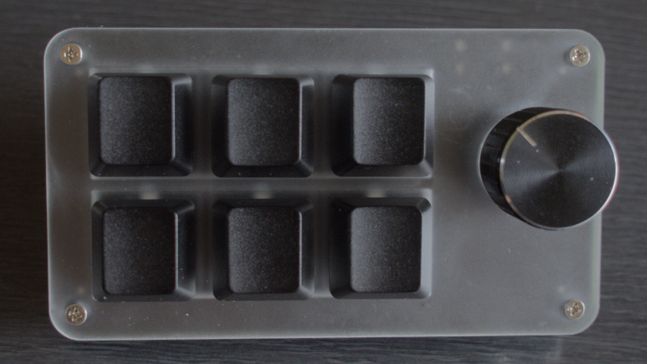
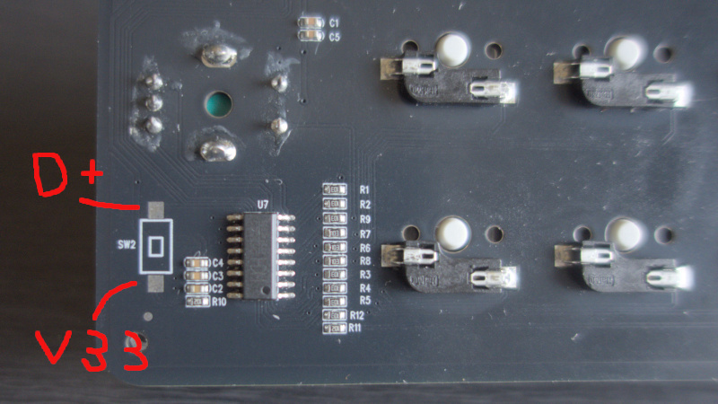

# CH552G Keyboard Custom Firmware

<p align="center">
  <a href="https://github.com/konohana-tech/ch552g-keyboard-cfw/blob/main/docs/images/mini_keyboard.jpg" target="_blank">
    
  </a>
</p>

CH552G マイコン搭載の小型キーボード（キー6個＋ロータリーエンコーダー＋LED6灯）用カスタムファームウェアです。
[Vial](https://get.vial.today/) 対応で、キーマップの変更はアプリ上から行えます。

- MCU: WCH CH552G
- USB: USB Type-C
- 入力: キー6個＋ ロータリーエンコーダー1基（プッシュスイッチ付き）
- LED: LED ×6（LED1–LED6、単色点灯/消灯のみ）
- Vial プロトコル v6、キーボードUID内蔵

## 必要なもの

| 用途 | 必要なもの |
|---|---|
| 書き込み | Chrome / Edge（WebUSB対応ブラウザ） |
| キーマップ変更 | Vial（デスクトップアプリまたは Web 版 [vial.rocks](https://vial.rocks/)） |
| Linux のみ | udev ルール（後述） |

## 書き込み手順

Web Flasher を使います（Chrome / Edge 専用）：

**[`web-flasher.html` を開く](https://konohana-tech.github.io/ch552g-keyboard-cfw/web-flasher.html)**

1. **ISPモードでキーボードを接続する**（手順は下記）
2. **「書き込み開始」を押す**（数秒で完了）
3. キーボードとして認識し直されたら成功。Vial でキーマッピングを確認してください

ファームウェアは常に最新版が1つだけ表示されます。手元の `.bin` を焼きたい場合は
「ローカルのファームウェアを使う」から指定できます。

### ISPモードにするには

本FWが書き込み済みの場合、**`KEY1＋KEY3＋KEY4＋KEY6` の4キーを押さえたまま USB を挿す**とISPモードで起動します。認識されたら離して構いません。挿してから押さえても入らないので、必ず先に押さえてから挿してください。

本FWが入っていない場合（初回・別FW・書き込み失敗時）は以下の方法を使ってください。基板裏面の `SW2` のシルク印刷周辺にあるテストパッドの **D+ と V33 をピンセット等でショートさせたまま USB を挿し**、
認識されたらショートを外します。

<p align="center">
  <a href="https://github.com/konohana-tech/ch552g-keyboard-cfw/blob/main/docs/images/SW2_pad.jpg" target="_blank">
    
  </a>
</p>

注意：

- ショートさせるのは D+ と V33 の2点だけです。他のピン（特に GND や電源系）に触れないでください
- 通電中の作業です。金属工具の滑りに注意し、基板上の他の部品に触れないでください
- うまく入らない場合は USB を抜き、ショートを確認してから挿し直してください
- ISPモードは一定時間経過すると通常モードに切り替わります

### 出荷時設定に戻すには

**`KEY1＋KEY3＋KEY5＋エンコーダースイッチ` を押さえたまま USB を挿す**と、保存したキーマップ・マクロ・LED設定が消去され初期値に戻ります。ISPモードの組み合わせ（上記）とは異なるので押し間違いに注意してください。挿してから押さえても入らないので、必ず先に押さえてから挿してください。

### Linux の udev 設定

Linux のみ以下の設定が必要です。ISP 書き込み用と Vial 接続用の2種類があります。
`/etc/udev/rules.d/99-ch55x-isp.rules` に以下3行を書き、抜き差しして反映させてください。

```udev
# ISP モード書き込み用
SUBSYSTEM=="usb", ATTR{idVendor}=="4348", ATTR{idProduct}=="55e0", MODE="0666"
SUBSYSTEM=="usb", ATTR{idVendor}=="1a86", ATTR{idProduct}=="55e0", MODE="0666"
# Vial 接続用（1209:0001 の hidraw アクセス）
KERNEL=="hidraw*", SUBSYSTEM=="hidraw", ATTRS{idVendor}=="1209", ATTRS{idProduct}=="0001", MODE="0666"
```

追記したら以下で有効化（または抜き差しでも反映されます）。

```sh
sudo udevadm control --reload-rules && sudo udevadm trigger
```

反映確認は `ls -l /dev/hidraw*` で該当デバイスが `crw-rw-rw-` になることです。

Windows / macOS では設定不要です。

## Vial 機能対応表

| カテゴリ | 対応 | 備考 |
|---|:---:|---|
| キーマップ編集 | ✓ | 4レイヤー |
| レイヤー切替キー | △ | 対応は MO・TO・LT のみ。キー6個のみ。エンコーダースイッチは MO・LTホールドのみ。LT のタップ側は通常キーのみ（修飾キー不可）。MO等でレイヤー有効中に別キーを押すと有効レイヤーのキーが出る（QMK準拠）。レイヤーを有効にしたキー自体の位置は無音 |
| Mod-Tap | △ | 左手修飾のみ（Shift/Alt/Ctrl/GUI）。右手系は無音。ネスト時（ABBA）は他キー離鍵で即hold（QMK PERMISSIVE_HOLD相当）、ロール時（ABAB）はtap維持。Bを先に押した場合はtap（QMK/ZMK準拠）。tap/hold判定は約200ms。保持中の他キーはレポート遅延保持（QMK waiting_buffer相当のlean版、hold確定は最新1キー）。tap確定時はA送出後に捕捉キーを連鎖送出するため速いタップでも消失しない |
| エンコーダー | ✓ | 1基。レイヤーごとに右回転/左回転を割付可 |
| Tap Dance | ✓ | 2枠（タップ/ホールド/ダブルタップ/タップホールド＋猶予時間） |
| マクロ | ✓ | 3枠（M0–M2）、合計36B |
| RGBライティング | △ | 単色点灯/消灯のみ。16色＋輝度調整可。流れるエフェクト等は非対応 |
| コンボ（同時押し） | ✗ | 非対応 |
| キーオーバーライド | ✗ | 非対応 |
| QMK Settings | ✗ | 設定項目なし |
| Layout オプション | ✗ | 切替項目なし |
| Vial セキュリティロック | ✓ | 起動時はロック状態。全7入力（キー6個＋エンコーダースイッチ）同時長押しでアンロック |
| Bootloader ジャンプ | ✓ | Vial から ISP モードへ遷移可（要アンロック） |

## トラブルシューティング

| 症状 | 対処 |
|---|---|
| Vial でリマップしても実機の入力に反映されない | 本体がロックされている。キー6個＋エンコーダースイッチの全7入力を同時に長押ししてアンロックする |

## ライセンス

MIT License（`LICENSE` 参照）。
